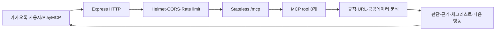
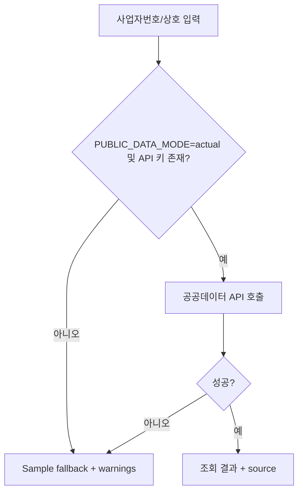

# 아키텍처

## 요청 처리 흐름

`src/server.ts`가 stateless Streamable HTTP transport와 8개 tool을 등록합니다. 각 요청마다 transport와 MCP server를 연결하고 응답 종료 시 닫으므로 사용자 세션이나 메시지를 보관하지 않습니다. `/mcp/info`는 도구·데이터 모드·안전 정책을 공개하며 `/debug/analyze`는 활성화된 개발 환경에서 여러 분석 결과를 한 번에 보여줍니다.

## MCP tool 등록 흐름

`createTalkSafeguardServer()`는 입력을 Zod schema로 검증한 뒤 tool handler를 호출합니다. 모든 handler는 `withSafety()`를 거쳐 `safetyMessage`와 `disclaimer`를 포함하고 `toToolResult()`가 텍스트와 structured content를 함께 반환합니다. `scripts/validate.ts`와 MCP in-memory client가 8개 이름과 실제 `tools/list` 결과를 검증합니다.

## 위험도 점수 흐름

1. `extractRiskIndicators`가 URL, 긴급성, 송금, 전화·계좌·사업자번호 후보와 민감정보 요구를 요청 메모리에서 추출합니다.
2. `classifyMessage`가 가족·기관·카카오 사칭, 상품권, 계정 탈취, 청첩장·부고, 투자·선입금 등 복합 규칙으로 유형을 분류합니다.
3. `analyzeMessage`가 신호별 가중치와 위험 조합의 최소 점수를 적용해 0~100 점수를 계산합니다.
4. `scoreToRiskLevel`이 LOW, MEDIUM, HIGH, CRITICAL로 변환합니다.
5. `buildFraudDecision`과 `generateSafetyGuide`가 질문에 대한 직접 답변, 진행 가능 여부, 확인 체크리스트, 금지 행동, 즉시 조치와 상담 요약을 만듭니다.

## URL 분석 흐름

URL은 `hxxp` 변형을 복원하고 hostname을 정규화한 뒤 sample 피싱 URL, sample 스팸 패턴, 단축 URL, IP 직접 접속, punycode, 과도한 하이픈·숫자, 브랜드 유사 도메인, 인증·이벤트 path를 점수화합니다. 응답은 정규화 URL, 도메인, 점수, 등급, 데이터 출처와 사람이 이해하기 쉬운 의심 신호를 반환합니다.

## 사업자 조회 fallback

실제 조회와 fallback 모두 `source`, `warnings`, `safeAction`을 제공하며 등록 확인이 거래 안전 보증이 아님을 명시합니다.

## 개인정보 비저장과 배포

메시지는 `processEphemeral` 경계 안에서만 처리되고 구조 로그에 전달되지 않습니다. Rate limit은 원본 IP 대신 프로세스별 salt 해시를 제한 시간 동안 메모리에 보관합니다. 빌드는 멀티 스테이지 Dockerfile에서 생성하고 최종 이미지는 production 의존성과 `dist`만 포함하며 비루트 `node` 사용자로 실행합니다. 외부 배포는 HTTPS reverse proxy 또는 관리형 컨테이너 환경을 전제로 합니다.
